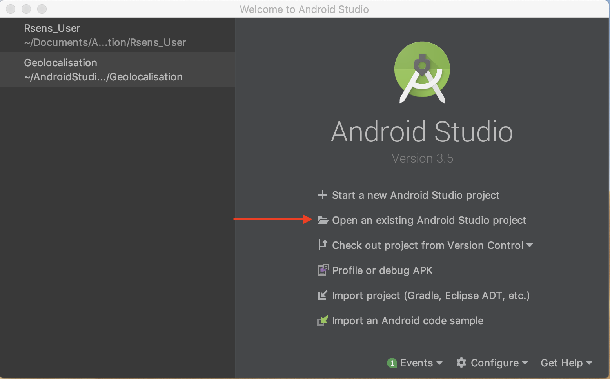
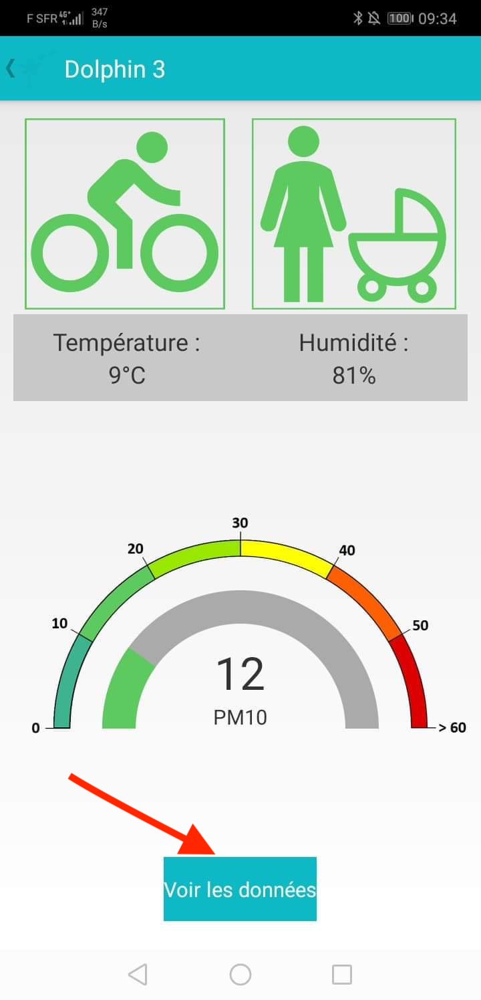
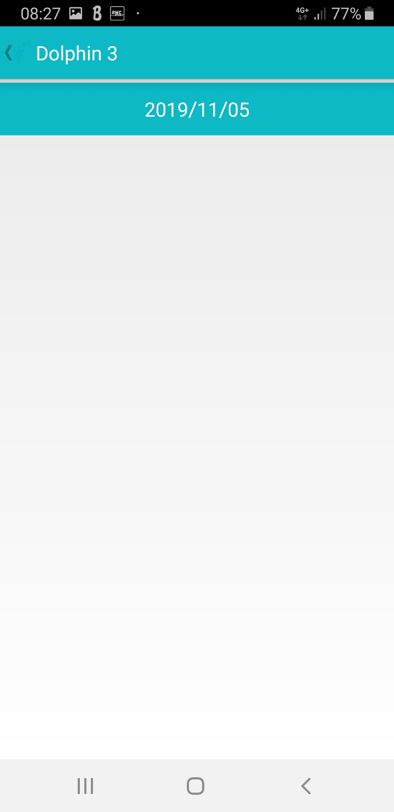

# RSENS App

### GENERAL PRESENTATION

You are interested in air pollution. You've come to the right place! Whether you are a neophile or a professional, this mobile application is made for you.
This application has been developed in order to be able to obtain information on air pollution at different locations from data collected by sensors.
The data thus collected are then processed and formatted to make graphical representations that are more meaningful than simple files containing the raw data.

### INSTALLATION

#### Installation of android studio

To install the mobile application, you must first download android studio if you do not have it yet.

* If you don't have android studio [click here](https://developer.android.com/studio#downloads) to download it.
* If you need help installing android studio [click here](https://developer.android.com/studio/install).

#### Installation of the mobile app

```Markdown
PREREQUISITE: A smartphone under android, android studio and a cable to connect the phone to the computer.
```

To install the mobile application, you must first download the project.
To download the application, go to [this page](https://gitlab.com/aird-rsens/great-air).
Then click to where the arrow in the image below points and choose the format in which you want to download it.


Once the project has been uploaded, it must be imported into android studio.
To do this, open android studio, then click on Open an existing Android Studio project. See the image below.



You will then have to search for the project to open on your hard disk and open it.
Once the project is open in android studio, connect your phone to your computer.
You then need to upload the mobile application to your phone.
To do this click on run see the image.


#### Installation of the deposit git

It is necessary to retrieve the source files of the program on the git. 
To do this, open a console and paste the following lines into it, replacing folderName with the folder name of your choice.

```sh
mkdir nameDirectory
cd nameDirectory
git clone https://gitlab.com/aird-rsens/rsens-app.git
cd Rsens
```

Then if you want to install the application on your android phone followed the `Installation android studio` section if you do not have it yet.
Then follow the section `Installation of the mobile application` from the import into android studio.

### THE MOBILE APPLICATION

The first time you launch the application you will be asked to access the geolocation that is required to run the application. If you refuse the application will close.


Once the geolocation has been accepted, you will need to identify yourself by entering your username and password.


After authentication you will see the sensors associated with you if you have any and otherwise you will get a message saying that you don't have associated sensor.

 No sensor                                                   |  One or more sensors
:-----------------------------------------------------------:|:----------------------------------------------------------------:
  |  

If you have an associated sensor you can choose one and once you have clicked on one of the sensors the application will search for it.


If the sensor is found you will have access to the data in real time and otherwise you will have access to the data history which is also available in the real time version by clicking on view data.

 Real time                                                         |  Not found
:-----------------------------------------------------------------:|:----------------------------------------------------------------:
     |  

   

If you have sensors associated to you can choose one in order to get information about the data that was collected.
Once the sensor has been selected, you can choose between the data from the last 3 days (if available) ,all the data or exit the application.


Once you have made your choice you will see a list with different dates on the screen where you can choose one to have a graph drawn from the data collected by this sensor.

 3 days data                                                 |  All data
:-----------------------------------------------------------:|:----------------------------------------------------------------:
     |  


### Code Organization

#### Parts of the project

The code is divided into 5 parts.
* activities : Contains the different views of the application.
* controller : Controller acts on both model and view. It controls the data flow into model object and updates the view whenever data changes. It keeps view and model separate.
* models : Model contains the data. It can also have logic to update controller if its data changes.
* services : Contains the components running in background.
* tasks : Contains the asyncTask use to make http request.

<strong> WARNING, asyncTask are deprecated since Android API Level 30. The documentation advises to use *java.util.concurrent*. I advises to use Volley. Volley is an HTTP library that makes networking for Android apps easier and most importantly, faster. Volley is available on GitHub.</strong>

#### PHP files of RSENS useful

Some PHP files of RSENS are usefull for the app.

* <strong>modify_mdp.php</strong> : Script to change the password of a user.
* <strong>user_deconnect.php</strong> : Disconnects the user.
* <strong>create_capteur.php</strong> : Check if the sensor exist in the database and if not create it.
* <strong>create_csv.php</strong> : Create a csv file with the data.
* <strong>create_user.php</strong> : Create a user.
* <strong>create_donnne5.php</strong> : Select all the information for a sensor and a version
* <strong>get_day_datas3.php</strong> : Retrieve data from a specific data and sensor.
* <strong>get_day2.php</strong> : Retrieve all the days
* <strong>get_day3.php</strong> : Retrieve all the days for a specific sensor.
* <strong>get_user.php</strong> : Autentification
* <strong>get_capteur</strong> : Get all sensors.

#### AsyncTask of the app

List of the asynckTask of the mobile app

* <strong>FetchDataTask</strong> : Used in <strong>DayActivity</strong>. It's used to retrieve the days in the DataBase. PHP file usefull <strong>get_day_data3.php</strong>
* <strong>FetchDayTask</strong> : Used in <strong>DayActivity</strong>. It's used to retrieve the dates in the DataBase. PHP file usefull <strong>get_day3.php</strong>
* <strong>FetchMdpTask</strong> : Used in <strong>InfoActivity</strong>. It's used to change the password of the user. PHP file usefull <strong>modify_mdp.php</strong>
* <strong>FetchPullTask</strong> : Used in <strong>PullActivity</strong>. It's used to retrieve the different sensors. PHP file usefull <strong>get_capteurs.php</strong>
* <strong>FetchTask</strong> : Used to save the data in the DataBase.
* <strong>FetchThreeDataTask</strong> : Used in <strong>ThreeDayActivity</strong>. It's used to retrieve the data on the 3 last day for a given sensor. PHP file usefull <strong>get_day_data3.php</strong>
* <strong>FetchThreeDayTask</strong> : Used in <strong>ThreeDayActivity</strong>. It's used to retrieve the 3 last day. PHP file usefull <strong>get_day3.php</strong>
* <strong>FetchUserTask</strong> : Used in <strong>MainActivity</strong>. It's used to check if the login and password given are ok for the authentication. PHP file usefull <strong>get_user</strong>.
* <strong>FetchWeatherTask</strong> : Used in <strong>DeviceControleActivity</strong>.

#### Controllers

* <strong>SharedPreferencesManager</strong> : Singleton used for the SharedPreferences. To be used whenever it is necessary to save informations for several activities and avoid to create every time a new object SharedPreferences.
* <strong>NotificationG</strong> : For the notification for example if the PM are higher than 40.

#### Services

<strong>BluethootLeService</strong> : manages the connections/disconnections and data of the bluetooth device

### CONTRIBUTORS
- [Nicolas Reiminger](@NicolasReiminger)
- [Xavier Jurado](@xjurado)
- [Maxime Eckstein](@meckstein)
